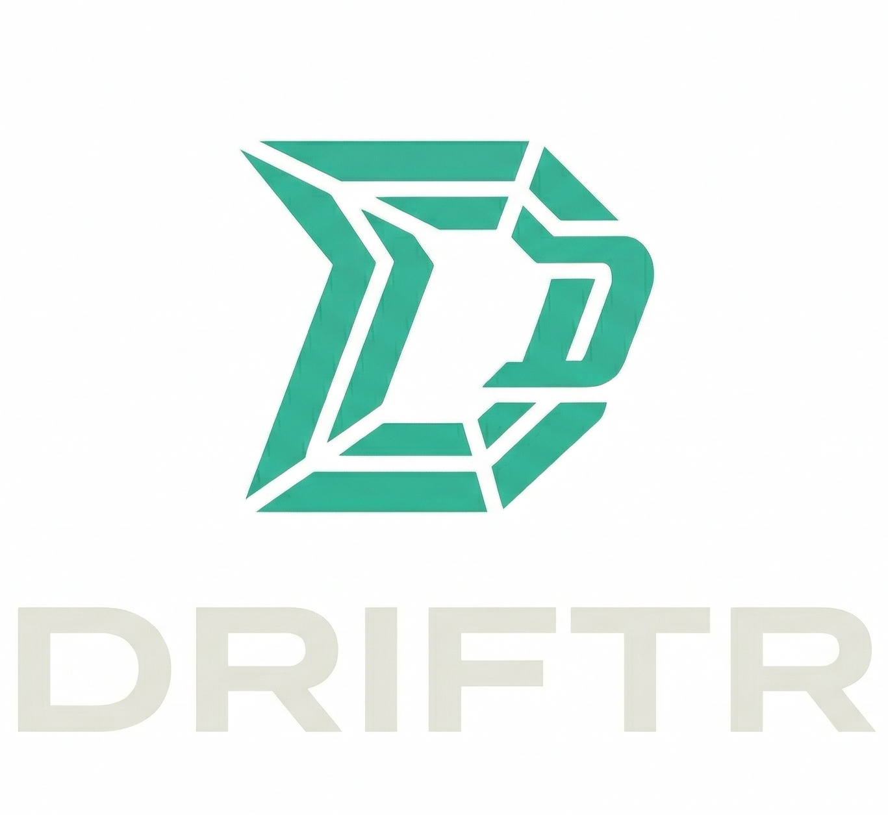
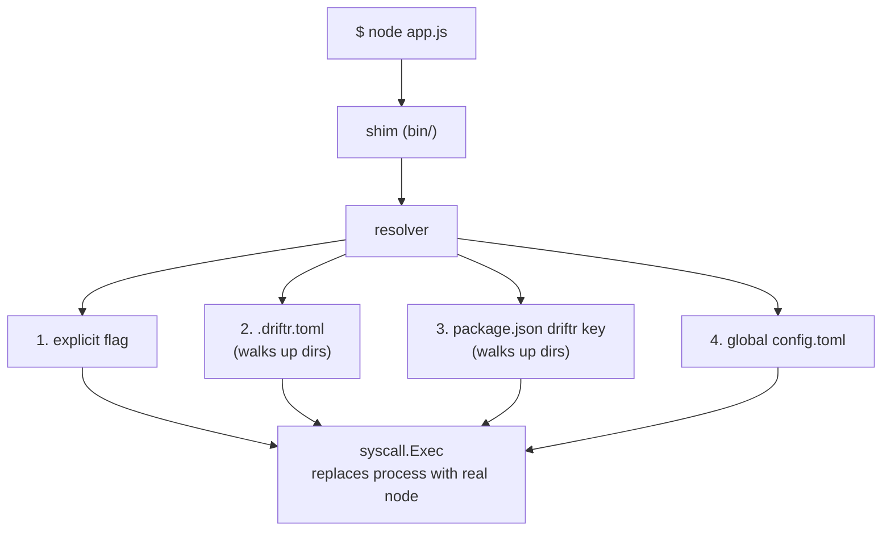

<p align="center">
  
</p>

<h1 align="center">Driftr</h1>

<p align="center">
  <strong>Fast Node.js versioning without the friction.</strong>
</p>

<p align="center">
  A cross-platform JavaScript toolchain manager focused on reproducible developer environments.
</p>

---

## What is Driftr?

Driftr manages Node.js versions so you don't have to think about them. Pin a version to your project, set a global default, and move between repositories without manual switching. Driftr resolves the right runtime instantly through lightweight shims.

- **Shim-based** -- `node`, `npm`, and `npx` just work, resolved per-project or globally
- **Fast** -- near-zero overhead via `syscall.Exec` process replacement
- **Deterministic** -- explicit resolution chain: project config > `package.json` > global default
- **Secure** -- SHA256 checksum verification on every download
- **Simple** -- six commands cover the entire workflow

## Install

```bash
curl -fsSL https://raw.githubusercontent.com/DriftrLabs/driftr/main/install.sh | sh
```

This downloads the latest release, verifies its checksum, and configures your PATH. See [docs/installation.md](docs/installation.md) for alternative methods.

## Quick Start

```bash
# Install Node.js
driftr install node@22

# Set global default
driftr default node@22.22.0

# Pin a project (prompts for .driftr.toml or package.json on first use)
cd my-project
driftr pin node@22.22.0

# It just works
node -v  # resolves automatically
```

## Commands

| Command | Description |
|---------|-------------|
| `driftr install node@<version>` | Download and install a Node.js version |
| `driftr default node@<version>` | Set the global default version |
| `driftr pin node@<version>` | Pin a version to the current project (`.driftr.toml` or `package.json`) |
| `driftr list` | List installed versions |
| `driftr which node` | Show which binary would be executed and why |
| `driftr run --node <ver> -- <cmd>` | Run a command under a specific version |
| `driftr setup` | Initialize Driftr and generate shims |

All commands support `-v` / `--verbose` for detailed output including resolver tracing and checksum details.

## How It Works



The shim in `~/.driftr/bin/node` intercepts calls, the resolver determines the correct version, and `syscall.Exec` replaces the process with the real Node.js binary. No child process, no signal forwarding, no overhead.

## Documentation

| Document | Description |
|----------|-------------|
| [Installation](docs/installation.md) | Detailed install guide for macOS and Linux |
| [Usage](docs/usage.md) | Full CLI reference with examples |
| [Configuration](docs/configuration.md) | Global and project config format |
| [Architecture](docs/architecture.md) | Internal design and module overview |
| [Contributing](docs/contributing.md) | How to contribute to the project |

## Project Layout

```
~/.driftr/
  bin/              shims (node, npm, npx)
  tools/node/       installed Node.js versions
    22.22.0/
    24.0.0/
  config/
    config.toml     global default settings
  cache/            downloaded archives
```

## Requirements

- macOS or Linux
- `curl` or `wget` (for the install script)
- Internet access (to download Node.js releases from nodejs.org)
- Go 1.23+ (only if building from source)

## License

MIT

## Contributing

See [docs/contributing.md](docs/contributing.md) for guidelines on how to contribute.
