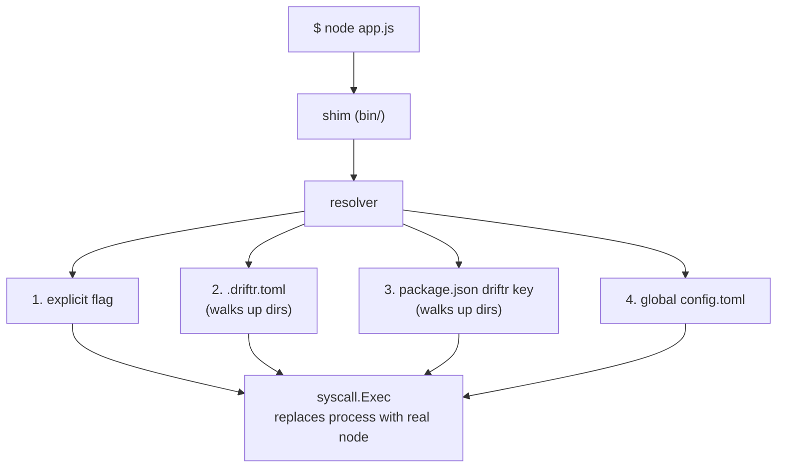

<p align="center">
  
</p>

<h1 align="center">Driftr</h1>

<p align="center">
  <strong>Fast JavaScript toolchain versioning without the friction.</strong>
</p>

<p align="center">
  A lightweight JavaScript toolchain manager built for speed and simplicity.<br>
  The spiritual successor to <a href="https://github.com/volta-cli/volta/issues/2080">Volta</a>, made for developers by developers.
</p>

---

## Why Driftr?

[Volta is no longer maintained.](https://github.com/volta-cli/volta/issues/2080) If you liked Volta's "pin and forget" model -- where `node`, `pnpm`, and `yarn` just work without manual switching -- Driftr carries that torch forward.

Driftr is a new project. It doesn't have Volta's years of polish or fnm's community size. But it has a clean foundation, an honest design, and an active maintainer who actually uses it. If you're looking for something simple that does the job, give it a try. If it's missing something you need, [open an issue](https://github.com/DriftrLabs/Driftr/issues) -- we're listening.

- **Multi-tool** -- manages Node.js, pnpm, and yarn from a single CLI
- **Shim-based** -- `node`, `npm`, `npx`, `pnpm`, `pnpx`, and `yarn` just work, resolved per-project or globally
- **Fast** -- near-zero overhead via `syscall.Exec` process replacement
- **Minimal** -- 2 external dependencies (cobra + toml), everything else is Go stdlib
- **Deterministic** -- explicit resolution chain: project config > `package.json` > global default
- **Secure** -- SHA256 and SHA-512 SRI checksum verification on every download
- **Simple** -- a handful of commands cover the entire workflow

## Install

```bash
curl -fsSL https://raw.githubusercontent.com/DriftrLabs/driftr/main/install.sh | sh
```

This downloads the latest release, verifies its checksum, and configures your PATH. See [docs/installation.md](docs/installation.md) for alternative methods.

## Quick Start

```bash
# Install your toolchain
driftr install node@22
driftr install pnpm@9
driftr install yarn@1

# Set global defaults
driftr default node@22.22.0
driftr default pnpm@9.15.0

# Pin a project (prompts for .driftr.toml or package.json on first use)
cd my-project
driftr pin node@22.22.0
driftr pin pnpm@9.15.0

# Everything just works
node -v   # resolves automatically
pnpm -v   # resolves automatically
```

## Commands

| Command | Description |
|---------|-------------|
| `driftr install <tool@version>` | Download and install a tool version (node, pnpm, yarn) |
| `driftr uninstall <tool@version>` | Remove an installed tool version |
| `driftr default <tool@version>` | Set the global default version for a tool |
| `driftr pin <tool@version>` | Pin a version to the current project (`.driftr.toml` or `package.json`) |
| `driftr list [tool]` | List installed versions (defaults to node) |
| `driftr which <tool>` | Show which binary would be executed and why |
| `driftr run --node <ver> -- <cmd>` | Run a command under a specific Node.js version |
| `driftr setup` | Initialize Driftr and generate shims |
| `driftr self-update` | Update Driftr to the latest version |

All commands support `-v` / `--verbose` for detailed output including resolver tracing and checksum details.

## Shell Completions

```bash
# zsh
echo 'eval "$(driftr completion zsh)"' >> ~/.zshrc

# bash
echo 'eval "$(driftr completion bash)"' >> ~/.bashrc

# fish
driftr completion fish | source
```

## How It Works



Shims in `~/.driftr/bin/` intercept calls to `node`, `npm`, `npx`, `pnpm`, `pnpx`, and `yarn`. The resolver determines the correct version, and `syscall.Exec` replaces the process with the real binary. Standalone tools (node, pnpm) are exec'd directly. Tools that need Node.js (yarn) are exec'd as `node <tool-script>`.

## Documentation

| Document | Description |
|----------|-------------|
| [Installation](docs/installation.md) | Detailed install guide for macOS and Linux |
| [Usage](docs/usage.md) | Full CLI reference with examples |
| [Configuration](docs/configuration.md) | Global and project config format |
| [Architecture](docs/architecture.md) | Internal design and module overview |
| [Contributing](docs/contributing.md) | How to contribute to the project |

## Project Layout

```
~/.driftr/
  bin/              shims (node, npm, npx, pnpm, pnpx, yarn)
  tools/
    node/           installed Node.js versions
    pnpm/           installed pnpm versions
    yarn/           installed yarn versions
  config/
    config.toml     global default settings
  cache/            downloaded archives + binaries
```

## How Driftr Compares

| | **Driftr** | **nvm** | **Volta** | **fnm** | **mise** |
|---|---|---|---|---|---|
| Language | Go | Shell | Rust | Rust | Rust |
| Mechanism | Shims | Shell function | Shims | PATH manipulation | PATH manipulation |
| Shell startup cost | ~1ms | 200-500ms | ~1ms | ~1ms | ~5ms |
| External dependencies | **2** | 0 (shell) | ~36 crates | 24 crates | 113 crates |
| macOS / Linux | Yes | Yes | Yes | Yes | Yes |
| Windows | No | No | Yes (rough) | Yes | Very basic |
| Manages npm/pnpm/yarn | **Yes** | No | Partial | No | Yes |
| Maintained | Yes | Yes | **No** | Yes | Yes |
| Self-update | `driftr self-update` | `nvm` script | No | No | `mise self-update` |

**When to choose Driftr**: You want a fast, minimal, shim-based manager for Node.js, pnpm, and yarn with a Volta-like experience -- pin versions to projects, and tools just work. You value simplicity and a small dependency footprint.

**When to choose something else**: If you need Windows support, fnm is your best bet. If you want one tool for Node + Python + Ruby + everything else, mise is the polyglot option. If nvm already works for you and startup time doesn't bother you, there's no reason to switch.

## Requirements

- macOS or Linux
- `curl` or `wget` (for the install script)
- Internet access (to download releases from nodejs.org, GitHub, and the npm registry)
- Go 1.26+ (only if building from source)

## License

MIT

## Contributing

See [docs/contributing.md](docs/contributing.md) for guidelines on how to contribute.
