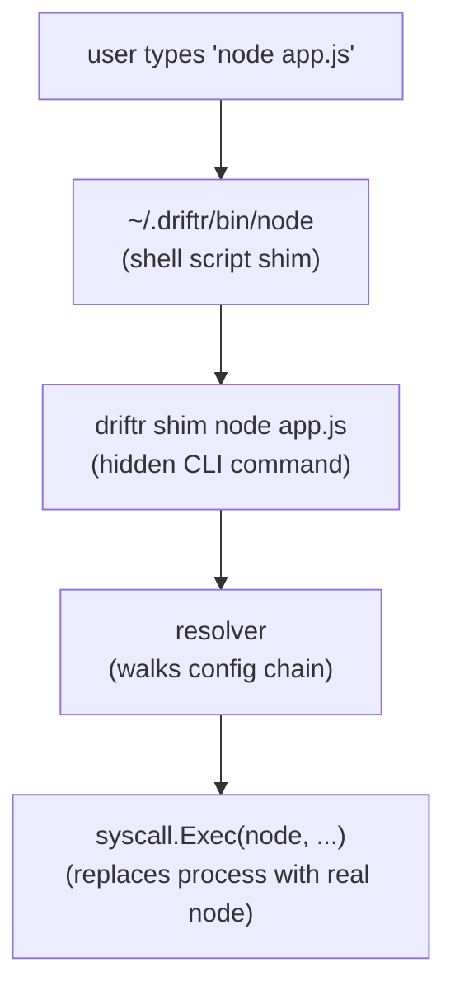
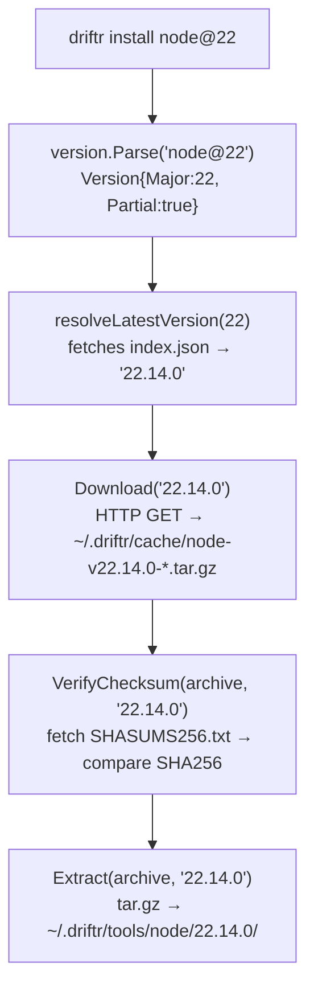
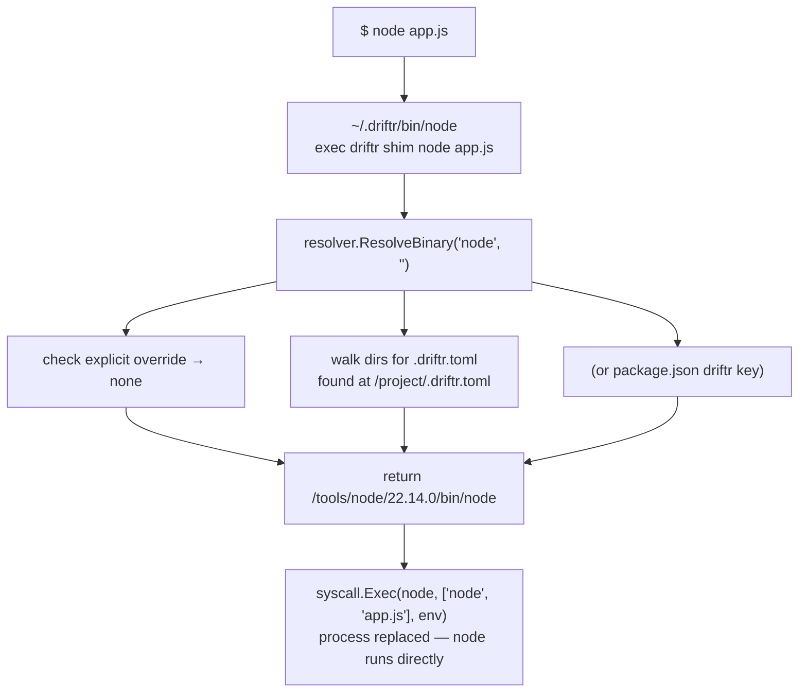

# Architecture

This document describes Driftr's internal design for contributors and anyone curious about how it works.

## Overview

Driftr is a shim-based toolchain manager. When you type `node`, `pnpm`, or `yarn`, a lightweight shim intercepts the call, resolves the correct version, and replaces itself with the real binary using `syscall.Exec`. The entire resolution happens in single-digit milliseconds.

Standalone tools (node, pnpm) are exec'd directly. Tools that need Node.js to run (yarn) are exec'd as `node <tool-script>`.



## Module Map

```text
cmd/driftr/
  main.go                   entry point

internal/
  cli/                      cobra command definitions
    root.go                 root command, global flags
    install.go              driftr install
    default.go              driftr default
    pin.go                  driftr pin
    list.go                 driftr list / ls
    which.go                driftr which
    run.go                  driftr run
    setup.go                driftr setup
    shim_cmd.go             driftr shim (hidden, called by shim scripts)

  config/                   configuration management
    global.go               ~/.driftr/config/config.toml read/write
    project.go              .driftr.toml read/write + directory walk
    packagejson.go          package.json driftr key read/write

  installer/                tool installation pipelines
    node.go                 Node.js: resolve → download → verify SHA256 → extract
    pnpm.go                 pnpm: resolve → download standalone binary from GitHub
    yarn.go                 yarn: resolve → download from npm registry → verify SRI → extract
    registry.go             npm registry client: version resolution, tarball download, SRI verification
    registry_extract.go     tarball extraction for npm registry packages
    download.go             HTTP download with caching and progress reporting
    extract.go              tar.gz extraction with path sanitization
    checksum.go             SHA256 verification against SHASUMS256.txt

  resolver/                 version resolution engine
    resolver.go             generic resolution: ResolveTool(), ResolveBinaryFull() with dual resolution

  shim/                     shim script generation
    shim.go                 creates shell scripts in ~/.driftr/bin/ (node, npm, npx, pnpm, pnpx, yarn)

  process/                  process execution
    exec.go                 syscall.Exec (replace) and exec.Command (child)

  platform/                 OS and architecture abstraction
    platform.go             paths, directories, OS/arch detection, toolBinaryMap

  version/                  version string parsing
    version.go              semver parsing with partial version and tool@ prefix support

  updater/                  self-update mechanism
    updater.go              checks GitHub releases, downloads and replaces binary
```

## Key Design Decisions

### Shim Architecture

Shims are simple shell scripts:

```sh
#!/bin/sh
exec "/usr/local/bin/driftr" shim node "$@"
```

Shims exist for `node`, `npm`, `npx`, `pnpm`, `pnpx`, and `yarn`. The `exec` replaces the shell process with `driftr`, and then `driftr` uses `syscall.Exec` to replace itself with the real binary. This double-exec means:

- No child process management
- Exit codes pass through natively
- stdin/stdout/stderr are preserved
- Signal handling is handled by the OS
- Near-zero latency overhead

There are two execution modes:

1. **Direct exec** (node, pnpm): `syscall.Exec(tool-binary, args, env)`
2. **Node-wrapped exec** (yarn): `syscall.Exec(node, [yarn.js, args...], env)` — because yarn is a JS script that needs Node.js to run. The Node version is co-resolved from the same config.

### `DisableFlagParsing` on Shim Command

The hidden `driftr shim` command sets `DisableFlagParsing: true` in cobra. This is critical because tool arguments like `node -v` or `npm --version` must pass through untouched. Without this, cobra would consume flags like `-v` as Driftr's own `--verbose` flag.

### Resolution Chain

The resolver follows a strict priority order:

1. **Explicit** -- `--node` flag on `driftr run`
2. **Project** -- `.driftr.toml` found by walking up from `cwd`
3. **package.json** -- `driftr` key in `package.json`, same walk-up
4. **Global** -- `~/.driftr/config/config.toml`

In each directory, `.driftr.toml` is checked before `package.json`. The closest config to the working directory wins, regardless of format.

Each tool resolves independently: `npm`/`npx` resolve via node's version (bundled), `pnpm`/`pnpx` via pnpm's version, and `yarn` via yarn's version. There is no system fallback — if no version is configured, Driftr returns an actionable error.

### Partial Version Resolution

Partial versions (e.g. `node@22`, `pnpm@9`) are resolved to the latest matching release:

- **Node.js**: queries `nodejs.org/dist/index.json`
- **pnpm/yarn**: queries the npm registry at `registry.npmjs.org/<package>`

### Checksum Verification

| Tool    | Method                                            |
|---------|---------------------------------------------------|
| Node.js | SHA256 against `SHASUMS256.txt` from nodejs.org   |
| pnpm    | No verification (standalone binary from GitHub)   |
| yarn    | SHA-512 SRI integrity from npm registry metadata  |

On failure, the cached archive is deleted so the next attempt re-downloads.

### Partial Install Cleanup

If extraction fails (disk full, corrupt archive, interrupted), the partially extracted directory is removed via `os.RemoveAll`. This prevents a broken installation from appearing valid to the resolver.

## Data Flow: Install



## Data Flow: Shim Execution



## Platform Abstraction

The `platform` package translates between Go's `runtime.GOOS`/`runtime.GOARCH` and Node.js distribution naming:

| Go | Node.js dist |
|----|-------------|
| `darwin` | `darwin` |
| `linux` | `linux` |
| `windows` | `win` |
| `amd64` | `x64` |
| `arm64` | `arm64` |

Archive format is `.tar.gz` on Unix and `.zip` on Windows (future). Binary paths differ by OS (`bin/node` vs `node.exe`).

## Dependencies

Driftr uses minimal external dependencies:

| Package | Purpose |
|---------|---------|
| `github.com/spf13/cobra` | CLI framework |
| `github.com/BurntSushi/toml` | TOML config parsing |

Everything else uses the Go standard library: `net/http` for downloads, `crypto/sha256` for checksums, `archive/tar` + `compress/gzip` for extraction, `syscall` for exec.
